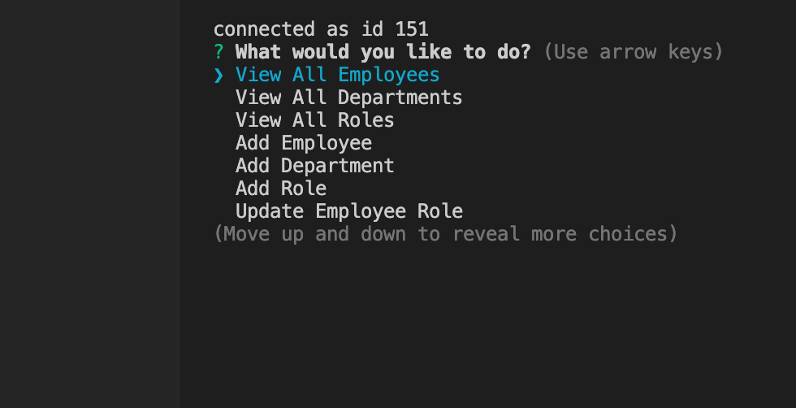
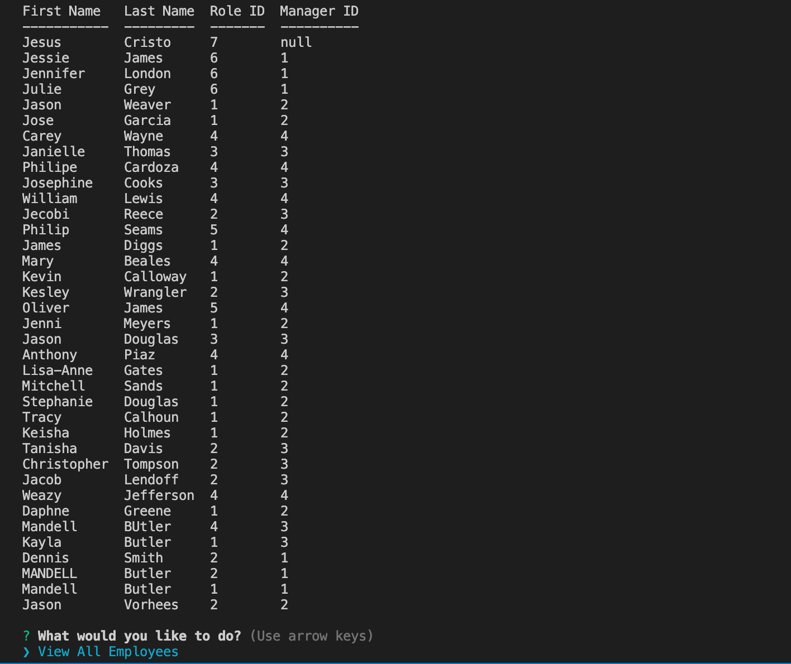
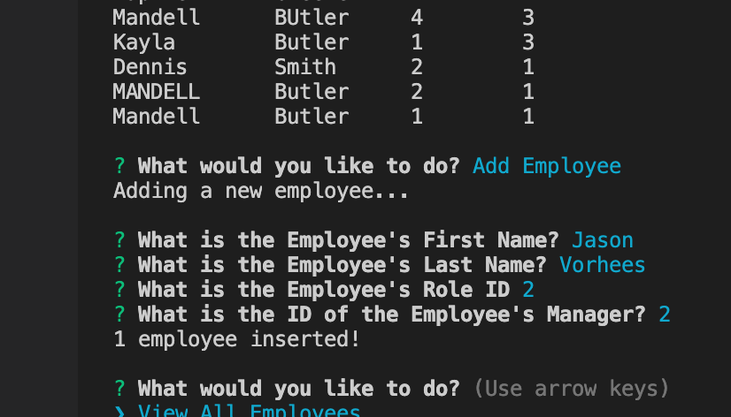
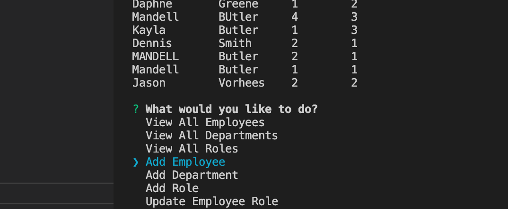

# Employee Management System

# Description
Employees are the cornerstone to an organization's success. However, the degree to which an organization will succeed is highly dependent upon their ability to smoothly and effectively manage, monitor, and communicate with their employees. Having a system in place, to facilitate this process, has never been more imperative to an organization's scalability and growth. 'Employee Management System' was designed with this in mind!

'Employee Management System' is a web application that facilitates the employee-management process, allowing for increased workflow and business functionality. With this innovative system, time and resource consuming tasks, such as onboarding and file management, are performed in minutes!

# Installation
To install, simply clone the Github repository and add it to your local repo via your choice code-editing software (ie Visual Studio Code).

# Usage
This Command line interface allows a user to:
* View departments, roles, employees
* Add departments, roles, employees
* Remove departments, roles, employees
* Update employee roles

Upon launching the application, the user is greeted with a list of tasks that can be performed from the command line. Simply follow the prompts to create, read, update, or delete data on a particular table.

Click on the link below and view a brief tutorial:
https://drive.google.com/file/d/1FkoKwByoJp8HDzOLZaI0su_SvcS9u4Vt/view

* User is greeted with User Prompts:

* Tables generate from user choices:

* Adding an Employee (Jason Vorhees):

* Will instantly update the table with the added Employee (Jason Vorhees):

# Technology
This application was made possible with the use of the follow dev tools:
* Node.js
* MYsql
* Inquirer
* Express.js

